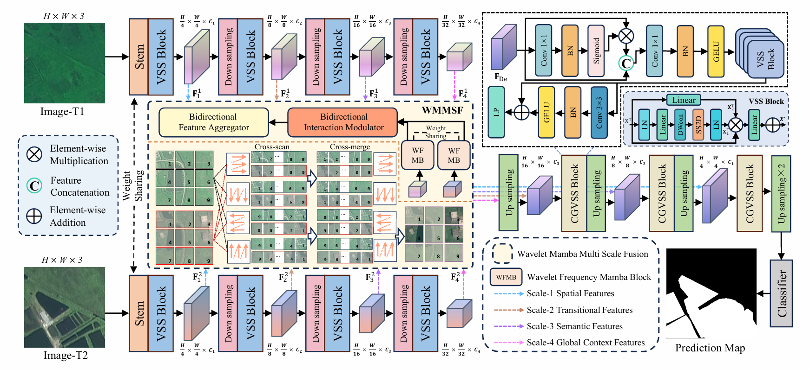

# WLAM-Net: A Wavelet-driven Locally Adaptive Mamba Network for Cropland Change Detection

This repository contains the official implementation of the paper: "WLAM-Net: Wavelet-driven Locally Adaptive Mamba Network for Cropland Change Detection", which has been submitted to *Pattern Recognition*.

**Authors:** [Haoran Wang], [Hao Bai], [Da Wu], [Jiaen Chen], [Xuewen Wang] ,[Yuchen Zheng] 

## 📢 News
- **[2026-04-13]** The repository is created.  
- **[2026-05-28]** The paper is submitted to Elsevier Pattern Recognition.
- **[Coming Soon]** Code and pretrained weights will be released upon acceptance.

## 📝 Abstract

Cropland change detection (CCD) is crucial for agricultural monitoring and food security. However, existing methods struggle with high frequency detail loss and multi scale interference, driven by structural heterogeneity and abrupt phenological transitions. These uncertainties fundamentally manifest as local boundary misalignments and regional target omissions, particularly when confronting massive semantic transformations or intricate artificial structures like agricultural greenhouses.

To overcome these limitations, we propose the **Wavelet driven Locally Adaptive Mamba Network (WLAM-Net)**, a novel architecture that explicitly refines edge localization and structural completeness in complex agricultural scenarios.

Specifically, the proposed **CS VSS block** asymmetrically partitions the input features, routing one subset for long range dependency modeling via the SS2D module, while the remaining subset undergoes depthwise convolutions to preserve local spatial details. This design mitigates the extensive computational overhead of standard full channel scanning. Furthermore, the **Wavelet Frequency Modulation Block (WFMB)** utilizes a frequency guided dual branch strategy to explicitly isolate directional gradients, focusing on fine grained boundaries and effectively mitigating high frequency degradation. Additionally, a cross temporal attention mechanism is introduced, where queries aggregate global context from the second temporal phase, while depthwise convolutions strictly preserve the localized structural details of the first phase, suppressing pseudo changes.

Extensive experiments on three representative benchmark datasets (JLYHCD, CLCD, and PX-CLCD) demonstrate that WLAM-Net significantly outperforms state of the art models like CDMamba and MDANet. Notably, our framework achieves the highest F1 score (e.g., 80.46% on JLYHCD) and trades parameter footprint for peak detection accuracy while maintaining practical computational execution without triggering algorithmic bottlenecks.

## 🚀 Framework

## 📂 Datasets

We comprehensively evaluate the proposed WLAM-Net through extensive experiments across three representative high-resolution cropland change detection datasets:
- **JLYHCD (Jilin-1)**   Jilin-1 website of CGSTL (satellite technology co., ltd.), [Online]. Available:https://www.jl1mall.com/.
- **CLCD**   A CNN-transformer network with multiscale context aggregation for fine-grained cropland change detection, IEEE Journal of Selected Topics in Applied Earth Observations and Remote Sensing.
- **PX-CLCD**   Snunet3+:Afull-scale connected siamese network and a dataset for cultivated land change detection in high-resolution remote-sensing images, IEEE Transactions on Geoscience and Remote Sensing

*(Suggestion: You can add download links for these datasets here once the repo is public)*

## ✒️ Citation
